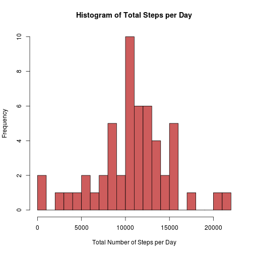
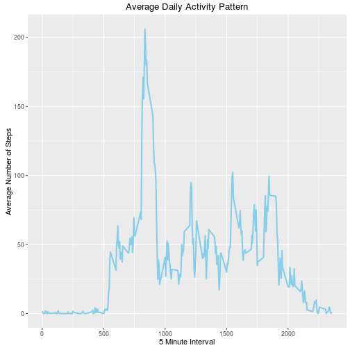
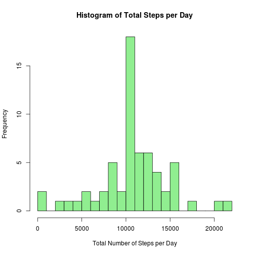
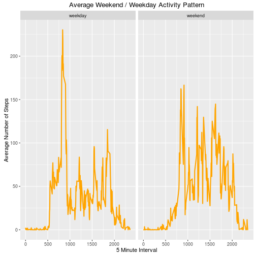

```r
---
title: "Reproducible Research: Peer Assessment 1"
author: "Navneet Kothari"
output:
keep_md: true
---


## Loading and preprocessing the data
```

```
## Error: <text>:10:0: unexpected end of input
## 8: 
## 9: ## Loading and preprocessing the data
##   ^
```

```r
library(ggplot2)
library(knitr)

opts_chunk$set(echo = TRUE)

unzip(zipfile = "activity.zip")
```

```
## Warning in unzip(zipfile = "activity.zip"): error 1 in extracting from zip
## file
```

```r
activity <- read.csv("activity.csv")
```

## What is mean total number of steps taken per day?

### Calculating the total steps per day and its mean and median

```r
total_steps_per_day <- aggregate(steps ~ date, activity, FUN = sum, na.rm = TRUE)
total_steps_mean <- mean(total_steps_per_day$steps)
total_steps_median <- median(total_steps_per_day$steps)
```

### Making a histogram of the total number of steps taken each day

```r
hist(total_steps_per_day$steps, col = "indianred", breaks = 25,
      xlab = "Total Number of Steps per Day",
      ylab = "Frequency",
      main = "Histogram of Total Steps per Day")
```


The mean and median of the total number of steps taken per day is 1.0766189 &times; 10<sup>4</sup> and 10765 respectively.


## What is the average daily activity pattern?

### Calculating the average daily avtivity pattern

```r
avg_daily_pattern <- aggregate(x = list(steps = activity$steps), by = list(interval = activity$interval), FUN = mean, na.rm = TRUE)
```

### Plotting the average daily activity pattern

```r
ggplot(data = avg_daily_pattern, aes(x = interval, y = steps)) +
    geom_line(col = "skyblue", size = 1) +
    xlab("5 Minute Interval") +
    ylab("Average Number of Steps") +
    ggtitle("Average Daily Activity Pattern")
```



### Calculating the 5-minute interval on average across all the days containing the maximum number of steps

```r
max_steps <- avg_daily_pattern[which.max(avg_daily_pattern$steps), ] 
```
The 5-minute interval containing the maximum number of steps is 835 with 206.1698113.


## Imputing missing values

### Calculating the total number of missing values in the dataset

```r
missing_values <- sum(is.na(activity$steps))
```
The total number of missing values in the dataset is 2304

### Devising a strategy for filling in all of the missing values in the dataset and creating a new dataset that is equal to the original dataset but with the missing data filled in

```r
filling_missing_values <- function(steps, interval) {
    filled_value <- NA
    if (!is.na(steps)) 
        filled_value <- c(steps) 
    else filled_value <- (avg_daily_pattern[avg_daily_pattern$interval == interval, "steps"])
    
    return(filled_value)
}
filled_value_activity <- activity
filled_value_activity$steps <- mapply(filling_missing_values, filled_value_activity$steps, filled_value_activity$interval)
```

### Calculating the mean and median. Making a histogram of the total number of steps taken each day using new dataset

```r
new_total_steps <- aggregate(steps ~ date, filled_value_activity, FUN = sum, na.rm = TRUE)
new_total_steps_mean <- mean(new_total_steps$steps)
new_total_steps_median <- median(new_total_steps$steps)

hist(new_total_steps$steps, col = "lightgreen", breaks = 25,
      xlab = "Total Number of Steps per Day",
      ylab = "Frequency",
      main = "Histogram of Total Steps per Day")
```



### Do these values differ from the estimates from the first part of the assignment?
The values differ but only slightly.

Mean(without missing values) = 1.0766189 &times; 10<sup>4</sup>
Mean(with missing values) = 1.0766189 &times; 10<sup>4</sup>

Median(without missing values) = 10765
Median(without missing values) = 1.0766189 &times; 10<sup>4</sup>

### What is the impact of imputing missing data on the estimates of the total daily number of steps?
As shown above, comparing with the calculations, we observe that while the mean value remains unchanged, the median value has shifted slightly.

After seeing both the histograms, it seems that the impact of imputing missing values has increase our peak, but it has not affected our predictions. 


## Are there differences in activity patterns between weekdays and weekends?

### Calculating weekend or weekday using the new dataset

```r
weekend_or_weekday <- function(date) {
    day <- weekdays(date)
    if (day %in% c("Monday", "Tuesday", "Wednesday", "Thursday", "Friday")) 
        return("weekday") 
    else if (day %in% c("Saturday", "Sunday")) 
        return("weekend")
}
filled_value_activity$date <- as.Date(filled_value_activity$date)
filled_value_activity$day <- sapply(filled_value_activity$date, FUN = weekend_or_weekday)
```

### Plotting the average weekend or weekday activity pattern

```r
avg_pattern <- aggregate(steps ~ interval + day, filled_value_activity, FUN = mean)
ggplot(data = avg_pattern, aes(x = interval, y = steps)) +
    geom_line(col = "orange", size = 1) +
    facet_grid(. ~ day) + 
    xlab("5 Minute Interval") +
    ylab("Average Number of Steps") +
    ggtitle("Average Weekend / Weekday Activity Pattern")
```


There are differences in the activity patterns between weekdays and weekends. Though the highest peak is in the weekday graph but the overall average above 100 is higher for weekends.
```

